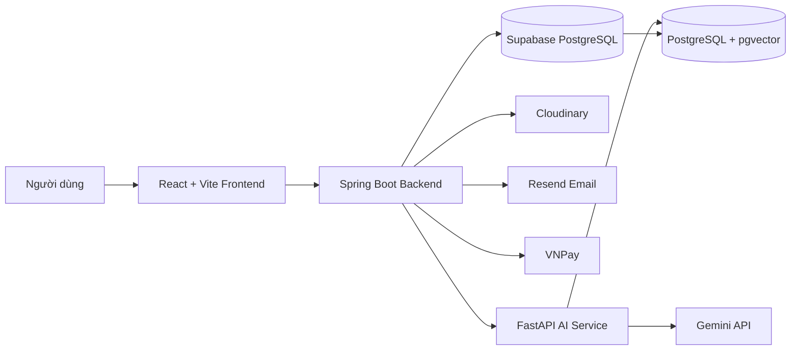
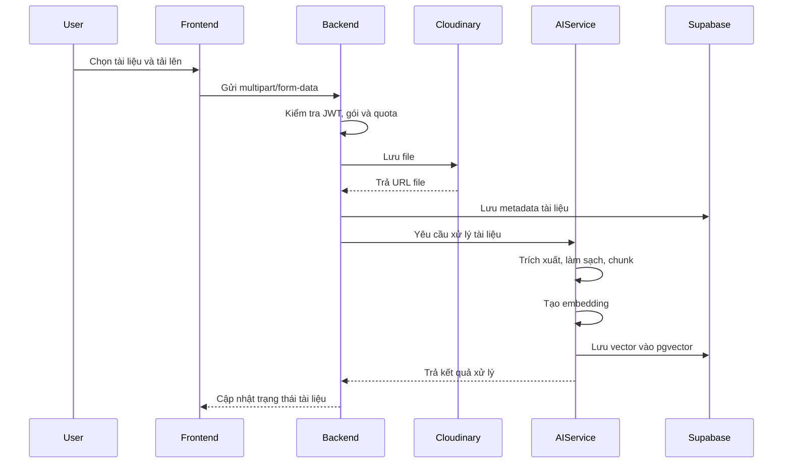

# AI Study Hub

AI Study Hub là nền tảng học tập và quản lý tài liệu tích hợp AI, hỗ trợ người dùng lưu trữ tài liệu, trích xuất nội dung, tìm kiếm ngữ nghĩa, trò chuyện với tài liệu, tóm tắt và tạo bài kiểm tra. Hệ thống được xây dựng theo kiến trúc tách biệt Frontend, Backend và AI Service để dễ mở rộng, triển khai và bảo trì.

## 1. Tổng quan

Hệ thống hướng đến việc giải quyết các nhu cầu chính của người học:

- Quản lý tài liệu học tập tập trung.
- Tìm kiếm nội dung nhanh bằng semantic search.
- Hỏi đáp trực tiếp dựa trên nội dung tài liệu bằng RAG.
- Tóm tắt tài liệu và tạo quiz tự động.
- Chia sẻ tài liệu hoặc cho phép người khác tải tài liệu lên bằng liên kết.
- Theo dõi dung lượng lưu trữ và số token AI đã sử dụng.
- Quản lý gói dịch vụ, thanh toán và phân quyền người dùng.

## 2. Chức năng chính

### 2.1. Xác thực và tài khoản

- Đăng ký tài khoản bằng email.
- Xác minh email và gửi lại email xác minh.
- Đăng nhập bằng email và mật khẩu.
- Đăng nhập bằng Google.
- Làm mới access token bằng refresh token.
- Quên mật khẩu và đặt lại mật khẩu.
- Cập nhật thông tin cá nhân và ảnh đại diện.
- Theo dõi trạng thái tài khoản và hoạt động người dùng.

### 2.2. Phân quyền

Hệ thống hỗ trợ các vai trò:

- `USER`: sử dụng các chức năng học tập, tài liệu và AI.
- `MANAGER`: quản lý một số chức năng vận hành theo quyền được cấp.
- `ADMIN`: quản lý người dùng, manager, gói dịch vụ, doanh thu, hoạt động và số liệu hệ thống.

Phân quyền được kiểm soát ở Backend bằng Spring Security, JWT và method-level security.

### 2.3. Quản lý tài liệu và thư mục

- Tạo, cập nhật và xóa thư mục.
- Tải tài liệu lên hệ thống.
- Lưu file trên Cloudinary.
- Quản lý metadata của tài liệu trong PostgreSQL.
- Kiểm tra giới hạn dung lượng và kích thước file theo gói dịch vụ.
- Xem danh sách, chi tiết và trạng thái xử lý tài liệu.
- Đổi tên, di chuyển, xóa và khôi phục quyền truy cập tài liệu.
- Tìm kiếm, lọc và sắp xếp tài liệu.
- Báo cáo tài liệu có nội dung không phù hợp hoặc có vấn đề.

### 2.4. Chia sẻ tài liệu

- Chia sẻ tài liệu cho người dùng khác.
- Tạo public link để xem tài liệu.
- Tạo liên kết chia sẻ có token.
- Tạo liên kết `shared-upload` để người khác tải tài liệu lên.
- Kiểm tra trạng thái, thời hạn và quyền của liên kết chia sẻ.
- Thu hồi hoặc vô hiệu hóa liên kết.

### 2.5. Trích xuất và xử lý nội dung

AI Service hỗ trợ xử lý nhiều loại tài liệu như:

- PDF thông thường.
- PDF dạng slide hoặc tài liệu scan.
- DOCX.
- PPTX.
- XLSX/XLS.
- Hình ảnh có nội dung cần phân tích.

Đối với PDF, hệ thống có thể phân loại theo tỉ lệ trang và đặc điểm nền để lựa chọn phương pháp trích xuất phù hợp:

- PyMuPDF cho PDF văn bản thông thường.
- Gemini cho slide, tài liệu scan hoặc bố cục phức tạp.
- Prompt phân loại khi hệ thống chưa xác định rõ loại tài liệu.

### 2.6. RAG và tìm kiếm ngữ nghĩa

Sau khi trích xuất nội dung, hệ thống thực hiện:

1. Làm sạch văn bản.
2. Chia nội dung thành các chunk.
3. Tạo embedding bằng Sentence Transformers.
4. Lưu embedding vào PostgreSQL với pgvector.
5. Truy vấn các chunk liên quan theo cosine similarity.
6. Gửi context phù hợp cho mô hình AI để tạo câu trả lời.

Vector của từng chunk được lưu trong bảng `document_chunk_embeddings` với khóa liên kết đến tài liệu.

### 2.7. Chat với tài liệu

- Tạo phiên chat theo tài liệu.
- Gửi câu hỏi bằng ngôn ngữ tự nhiên.
- Tìm các đoạn liên quan bằng pgvector.
- Sinh câu trả lời dựa trên nội dung tài liệu.
- Lưu lịch sử phiên chat.
- Hạn chế trả lời ngoài phạm vi context khi cần.
- Theo dõi token sử dụng của từng người dùng.

### 2.8. Tóm tắt tài liệu

- Tóm tắt toàn bộ tài liệu hoặc nội dung đã trích xuất.
- Chia nhỏ nội dung dài thành nhiều phần xử lý.
- Tổng hợp kết quả thành bản tóm tắt cuối cùng.
- Ghi nhận số token đã dùng cho chức năng tóm tắt.

### 2.9. Tạo quiz

- Tạo câu hỏi từ nội dung tài liệu.
- Sinh đáp án và đáp án đúng.
- Chấm điểm kết quả làm bài.
- Lưu kết quả quiz theo người dùng.
- Ghi nhận token sử dụng cho chức năng quiz.

### 2.10. Gói dịch vụ và hạn mức

- Quản lý các gói như `FREE`, `PRO` hoặc các gói tùy chỉnh.
- Giới hạn dung lượng lưu trữ.
- Giới hạn kích thước file tải lên.
- Giới hạn token AI theo ngày.
- Cho phép hoặc chặn từng loại file theo gói.
- Quản lý ngày bắt đầu, ngày hết hạn và trạng thái subscription.

### 2.11. Thanh toán VNPay

- Tạo URL thanh toán VNPay.
- Lưu giao dịch ở trạng thái `PENDING`.
- Lưu snapshot thông tin gói tại thời điểm mua.
- Xác minh chữ ký HMAC-SHA512 khi VNPay trả kết quả.
- Cập nhật giao dịch thành công hoặc thất bại.
- Kích hoạt hoặc gia hạn subscription.
- Chuyển hướng người dùng về Frontend sau thanh toán.
- Hỗ trợ truy vấn và hoàn tiền theo cấu hình hệ thống.

### 2.12. Theo dõi token

Hệ thống lưu số token sử dụng theo ngày:

- `chatTokens`.
- `summaryTokens`.
- `quizTokens`.
- `totalTokens`.
- `extractTokens`.
- `overallTokens`.

Trong đó:

- `totalTokens` được dùng để kiểm tra hạn mức AI hằng ngày.
- `extractTokens` dùng để theo dõi chi phí trích xuất và không nhất thiết tính vào giới hạn người dùng.
- `overallTokens = totalTokens + extractTokens` phục vụ báo cáo tổng hợp.

Admin có thể xem báo cáo theo:

- Một ngày cụ thể.
- Tuần.
- Tháng.
- Khoảng ngày tùy chọn.
- Một người dùng hoặc toàn bộ người dùng.

### 2.13. Trang quản trị

- Quản lý người dùng.
- Tạo và quản lý manager.
- Khóa, mở khóa hoặc cập nhật trạng thái tài khoản.
- Cập nhật vai trò người dùng.
- Quản lý các gói subscription.
- Theo dõi doanh thu.
- Xem hoạt động người dùng.
- Xem thống kê token và dung lượng.
- Theo dõi giao dịch thanh toán.

## 3. Kiến trúc hệ thống



### Luồng xử lý tài liệu



## 4. Công nghệ sử dụng

### Frontend

- React.
- TypeScript.
- Vite.
- Tailwind CSS.
- Axios.
- React Router.

### Backend

- Java 17.
- Spring Boot.
- Spring Security.
- JWT Authentication.
- Spring Data JPA / Hibernate.
- BCrypt.
- PostgreSQL Driver.
- Swagger / OpenAPI.

### AI Service

- Python.
- FastAPI.
- Uvicorn.
- Gemini API.
- PyMuPDF.
- python-docx.
- python-pptx.
- openpyxl.
- Sentence Transformers.
- psycopg2.
- pgvector.

### Database, Storage và dịch vụ ngoài

- Supabase PostgreSQL.
- PostgreSQL `pgvector` extension.
- Cloudinary.
- Resend.
- VNPay Sandbox/Production.
- Google OAuth 2.0.

### Deployment

- Frontend: Vercel.
- Backend: Google Cloud Run.
- AI Service: Google Cloud Run.
- Database: Supabase.
- Container Registry: Google Artifact Registry.
- Build: Google Cloud Build.

## 5. Cấu trúc thư mục

```text
AI-study-hub-ver1.0/
├── frontend/                # React + Vite
├── backend/                 # Spring Boot REST API
├── ai-service/              # FastAPI AI Service
├── docs/                    # Tài liệu hệ thống nếu có
├── .gitignore
└── README.md
```

## 6. Yêu cầu môi trường

- Node.js 18 trở lên.
- npm.
- Java 17.
- Maven hoặc Maven Wrapper.
- Python 3.11 trở lên.
- PostgreSQL hoặc tài khoản Supabase.
- Tài khoản Cloudinary.
- Gemini API key.
- Resend API key.
- Google OAuth Client ID.
- Tài khoản VNPay Sandbox nếu kiểm thử thanh toán.

## 7. Cấu hình biến môi trường

> Không commit mật khẩu, API key hoặc file môi trường thật lên GitHub.

### 7.1. Frontend

Tạo file `frontend/.env.local`:

```env
VITE_API_URL=http://localhost:8080
VITE_GOOGLE_CLIENT_ID=your_google_client_id
```

Khi deploy Vercel, cấu hình các biến này trong Project Settings.

Lưu ý: biến có tiền tố `VITE_` sẽ xuất hiện trong bundle Frontend, vì vậy không được lưu secret trong các biến này.

### 7.2. Backend

Các biến thường dùng:

```env
SPRING_DATASOURCE_URL=jdbc:postgresql://host:5432/postgres?sslmode=require
SPRING_DATASOURCE_USERNAME=postgres.project_ref
SPRING_DATASOURCE_PASSWORD=your_database_password

HIBERNATE_DDL_AUTO=update
JPA_SHOW_SQL=false

JWT_SECRET=your_jwt_secret

CLOUDINARY_CLOUD_NAME=your_cloud_name
CLOUDINARY_API_KEY=your_cloudinary_api_key
CLOUDINARY_API_SECRET=your_cloudinary_api_secret

RESEND_API_KEY=your_resend_api_key
RESEND_FROM_EMAIL=noreply@your-verified-domain.com

GOOGLE_CLIENT_ID=your_google_client_id

AI_SERVICE_BASE_URL=http://localhost:8000
FRONTEND_BASE_URL=http://localhost:5173
CORS_ALLOWED_ORIGINS=http://localhost:5173

VNPAY_TMN_CODE=your_vnpay_tmn_code
VNPAY_HASH_SECRET=your_vnpay_hash_secret
VNPAY_PAY_URL=https://sandbox.vnpayment.vn/paymentv2/vpcpay.html
VNPAY_API_URL=https://sandbox.vnpayment.vn/merchant_webapi/api/transaction
VNPAY_RETURN_URL=http://localhost:8080/api/payments/vnpay-return
```

Trong production nên dùng:

```env
HIBERNATE_DDL_AUTO=validate
```

### 7.3. AI Service

Tạo file `ai-service/.env`:

```env
GEMINI_API_KEY=your_gemini_api_key

VECTOR_STORE=pgvector
PGVECTOR_HOST=your_supabase_pooler_host
PGVECTOR_PORT=5432
PGVECTOR_DATABASE=postgres
PGVECTOR_USER=postgres.project_ref
PGVECTOR_PASSWORD=your_database_password
PGVECTOR_SSLMODE=require
```

## 8. Chạy dự án ở local

### 8.1. Chạy AI Service

```bash
cd ai-service
python -m venv .venv
```

Windows PowerShell:

```powershell
.\.venv\Scripts\Activate.ps1
pip install -r requirements.txt
uvicorn main:app --reload --host 0.0.0.0 --port 8000
```

Swagger AI Service:

```text
http://localhost:8000/docs
```

### 8.2. Chạy Backend

```bash
cd backend
```

Windows:

```powershell
.\mvnw.cmd spring-boot:run
```

Hoặc:

```bash
mvn spring-boot:run
```

Swagger Backend:

```text
http://localhost:8080/swagger-ui/index.html
```

### 8.3. Chạy Frontend

```bash
cd frontend
npm install
npm run dev
```

Frontend local:

```text
http://localhost:5173
```

## 9. Build production

### Frontend

```bash
cd frontend
npm install
npm run build
```

Kết quả được tạo trong:

```text
frontend/dist/
```

### Backend

```bash
cd backend
./mvnw clean package -DskipTests
```

Hoặc trên Windows:

```powershell
.\mvnw.cmd clean package -DskipTests
```

### AI Service

AI Service được build bằng Buildpacks hoặc Docker tùy môi trường triển khai.

## 10. Triển khai

### 10.1. Frontend trên Vercel

Thiết lập:

```text
Root Directory: frontend
Framework Preset: Vite
Build Command: npm run build
Output Directory: dist
```

Environment Variables:

```env
VITE_API_URL=https://your-backend-cloud-run-url
VITE_GOOGLE_CLIENT_ID=your_google_client_id
```

Đối với React Router, file `frontend/vercel.json` cần rewrite về `index.html`:

```json
{
  "rewrites": [
    {
      "source": "/(.*)",
      "destination": "/index.html"
    }
  ]
}
```

### 10.2. Backend trên Google Cloud Run

Backend sử dụng Dockerfile và Google Cloud Build.

```bash
gcloud builds submit \
  --region asia-southeast1 \
  --tag asia-southeast1-docker.pkg.dev/PROJECT_ID/cloud-run-source-deploy/ai-study-hub-backend:VERSION \
  backend
```

Deploy image:

```bash
gcloud run deploy ai-study-hub-backend \
  --image asia-southeast1-docker.pkg.dev/PROJECT_ID/cloud-run-source-deploy/ai-study-hub-backend:VERSION \
  --region asia-southeast1 \
  --allow-unauthenticated \
  --memory 1Gi \
  --cpu 1 \
  --timeout 300 \
  --concurrency 20 \
  --max-instances 3 \
  --env-vars-file backend/cloudrun-backend.env.yaml
```

### 10.3. AI Service trên Google Cloud Run

```bash
gcloud run deploy ai-study-hub-ai-service \
  --source ai-service \
  --region asia-southeast1 \
  --allow-unauthenticated \
  --memory 2Gi \
  --cpu 2 \
  --timeout 900 \
  --concurrency 1 \
  --max-instances 2 \
  --env-vars-file ai-service/cloudrun.env.yaml
```

## 11. Địa chỉ hệ thống

### Production

- Frontend: `https://ai-study-hub-ver1-0.vercel.app`
- AI Service Swagger: `https://ai-study-hub-ai-service-209240004299.asia-southeast1.run.app/docs`
- Backend Swagger: `https://YOUR_BACKEND_CLOUD_RUN_URL/swagger-ui/index.html`

### Local

- Frontend: `http://localhost:5173`
- Backend: `http://localhost:8080`
- Backend Swagger: `http://localhost:8080/swagger-ui/index.html`
- AI Service: `http://localhost:8000`
- AI Service Swagger: `http://localhost:8000/docs`

## 12. Bảo mật

- Mật khẩu được mã hóa bằng BCrypt.
- Backend sử dụng JWT và stateless session.
- API được phân quyền theo `USER`, `MANAGER`, `ADMIN`.
- CORS chỉ cho phép các domain được cấu hình.
- Secret không được lưu trong repository.
- File môi trường production phải được thêm vào `.gitignore`.
- API key từng xuất hiện trong Git history cần được thu hồi và tạo lại.
- Production nên dùng Secret Manager thay cho file môi trường nếu có thể.

Các file không được commit:

```gitignore
ai-service/.env
ai-service/cloudrun.env.yaml
backend/.env
backend/cloudrun-backend.env.yaml
frontend/.env.local
frontend/.env.*.local
frontend/dist/
```

## 13. Quy trình sử dụng cơ bản

1. Người dùng đăng ký và xác minh email.
2. Người dùng đăng nhập vào hệ thống.
3. Hệ thống kiểm tra gói subscription và hạn mức.
4. Người dùng tải tài liệu lên.
5. Backend lưu file trên Cloudinary và metadata vào Supabase.
6. AI Service trích xuất, chia chunk và tạo embedding.
7. Người dùng có thể tìm kiếm, chat, tóm tắt hoặc tạo quiz.
8. Token và dung lượng sử dụng được ghi nhận.
9. Người dùng có thể nâng cấp gói qua VNPay.
10. Admin theo dõi người dùng, doanh thu và hoạt động hệ thống.

## 14. Thành viên nhóm

| Thành viên | Vai trò | Trách nhiệm chính |
|---|---|---|
| Thành viên 1 | Team Lead / Backend | Điều phối nhóm, Backend, Database, Deployment |
| Thành viên 2 | Frontend Developer | Giao diện, tích hợp API, trải nghiệm người dùng |
| Thành viên 3 | AI Developer | AI Service, extraction, RAG, embedding |
| Thành viên 4 | Developer | Chức năng hệ thống và kiểm thử |
| Thành viên 5 | Developer | Chức năng hệ thống và tài liệu |

> Cập nhật lại tên thành viên và vai trò thực tế của nhóm trước khi nộp dự án.

## 15. Tài liệu liên quan

Có thể lưu tài liệu trong thư mục `docs/`:

```text
docs/
├── SRS.docx
├── Use_Case_Specification.docx
├── System_Architecture.png
├── Database_Diagram.png
└── API_Documentation.md
```

## 16. License

Dự án được phát triển cho mục đích học tập và nghiên cứu.
